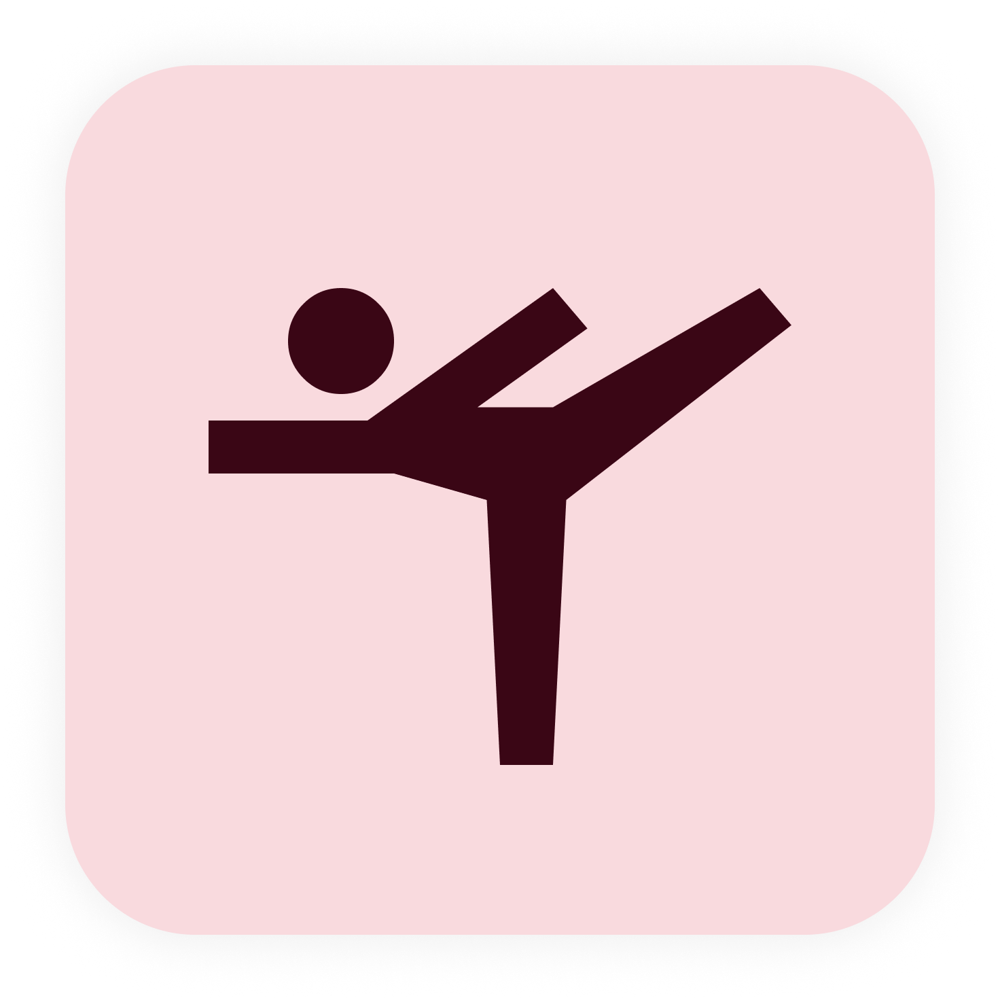

# Navi

AI Exercise Assistant

## Getting Started

This project is a starting point for a Flutter application.

A few resources to get you started if this is your first Flutter project:

- [Lab: Write your first Flutter app](https://docs.flutter.dev/get-started/codelab)
- [Cookbook: Useful Flutter samples](https://docs.flutter.dev/cookbook)

For help getting started with Flutter development, view the
[online documentation](https://docs.flutter.dev/), which offers tutorials,
samples, guidance on mobile development, and a full API reference.


<!-- REPLACE ALL THE [userHP200104] TEXT WITH YOUR GITHUB PROFILE NAME & THE [Navi_AI] WITH THE NAME OF YOUR GITHUB PROJECT -->

<!-- Repository Information & Links-->
<br />


[![LinkedIn][linkedin-shield]][linkedin-url]
[![Behance][behance-shield]][behance-url]

<!-- HEADER SECTION -->
<h5 align="center" style="padding:0;margin:0;">Hansin Prema</h5>
<h5 align="center" style="padding:0;margin:0;">200104</h5>
<h6 align="center">Interactive Development 300</h6>
</br>
<p align="center">

  <a href="https://github.com/userHP200104/Navi_AI">
    
  </a>
  
  <h3 align="center">Navi_AI</h3>

  <p align="center">
    AI Yoga Assistant<br>
      <a href="https://github.com/userHP200104/Navi_AI"><strong>Explore the docs »</strong></a>
   <br />
   <br />
    <a href="https://github.com/userHP200104/Navi_AI/issues">Report Bug</a>
    ·
    <a href="https://github.com/userHP200104/Navi_AI/issues">Request Feature</a>
</p>
<!-- TABLE OF CONTENTS -->

## Table of Contents

* [About the Project](#about-the-project)
  * [Project Description](#project-description)
  * [Built With](#built-with)
* [Getting Started](#getting-started)
  * [Prerequisites](#prerequisites)
  * [How to install](#how-to-install)
* [Features and Functionality](#features-and-functionality)
* [Concept Process](#concept-process)
   * [Ideation](#ideation)
* [Development Process](#development-process)
   * [Implementation Process](#implementation-process)
        * [Highlights](#highlights)
        * [Challenges](#challenges)
   * [Future Implementation](#future-implementation)
* [Final Outcome](#final-outcome)
    * [Video Demonstration](#video-demonstration)
* [Roadmap](#roadmap)
* [Contributing](#contributing)
* [License](#license)
* [Contact](#contact)
* [Acknowledgements](#acknowledgements)

<!--PROJECT DESCRIPTION-->
## About the Project
<!-- header image of project -->

![image8][image8]

### Project Description

This is an app that uses AI to detect whether you are doing a chosen yoga pose correctly or not.

### Built With

* [Flutter](https://docs.flutter.dev/)
* [Dart](https://dart.dev/guides)
* [ML Kit](https://developers.google.com/ml-kit)
* [TensorFLow Lite](https://www.tensorflow.org/lite/api_docs)
* [Teachable Machine](https://teachablemachine.withgoogle.com/)
* [Android Studio](https://developer.android.com/studio)
* [Firebase](https://firebase.google.com/docs?gclid=CjwKCAiA68ebBhB-EiwALVC-Nj1sU3VpTN-suZ_Rl2Ut_STPnhziJmvoeeOD2cXXvMUv00iAa1UolRoCpLUQAvD_BwE&gclsrc=aw.ds)
* [GitHub](https://github.com/)

<!-- GETTING STARTED -->
<!-- Make sure to add appropriate information about what prerequesite technologies the user would need and also the steps to install your project on their own mashines -->
## Getting Started

The following instructions will get you a copy of the project up and running on your local machine for development and testing purposes.

### Prerequisites

Ensure that you have the latest version of [Android Studio](https://developer.android.com/studio) installed on your machine.
### How to install

### Installation
Here are a couple of ways to clone this repo:

1. Clone Repository </br>
Run the following in the command-line to clone the project:
   ```sh
   git clone https://github.com/userHP200104/Navi_AI.git
   ```
    Open `Software` and select `File | Open...` from the menu. Select cloned directory and press `Open` button.

5. Run the following in the command-line to check if you have everything installed to run flutter:
    ```sh
    flutter doctor
    ```

5. Run the following in the command-line to get all the required dependancies:
    ```sh
    flutter pub get
    ```

5. Run the following in the command-line to run the app:
    ```sh
    flutter run
    ```


<!-- FEATURES AND FUNCTIONALITY-->
<!-- You can add the links to all of your imagery at the bottom of the file as references -->
</br>

## Features and Functionality
### Home

On the home scree you will find the number of poses completed weekly, your overall accuracy of all your poses, a them changer and a dark mode toggle.

![image1][image1]

### Dark Mode

The dark mode toggle will switch the theme between dark mode and light mode.

![image2][image2]

### Theme Change

The theme change allows you to set the theme of the app by utilising  dynamic colour palette.

![image3][image3]

### Yoga

This screen allows you to add and delete yoga poses you want to do. It is also an access point for the pose checker.

![image4][image4]

### Add a Pose

This is a bottom sheet that comes up which allows you to select a pose that you want to add.

![image5][image5]

### Pose Checker

This uses Ml and AI to track your bodies position to see if you are doing the pose you chose correctly.

![image6][image6]


<!-- CONCEPT PROCESS -->
<!-- Briefly explain your concept ideation process -->
## Concept Process

### Everything Google

![image10][image10]
![image11][image11]
![image12][image12]
![image13][image13]
![image14][image14]
![image15][image15]

### Database Structure
![image9][image9]

<!-- DEVELOPMENT PROCESS -->
## Development Process

The `Development Process` is the technical implementations and functionality done in the frontend and backend of the application.

### Implementation Process
<!-- stipulate all of the functionality you included in the project -->

* Project created and `Frontend` implemented.
* `Firebase` set up and linked to project.
* Components made compatible with Material 3.
* `Body Detetion` added to live camera
* Poses fetched from database.
* `Yoga Pose Model Trained`
* `Yoga Pose Model` added to live camera.
* Functionality added to display if the pose is correct or not.


#### Highlights
<!-- stipulated the highlight you experienced with the project -->
* I really enjoyed how simple Flutter is too use considering this was my first time using it. Even though the structure of the code was different everything works together realy seemlessly.

#### Challenges
<!-- stipulated the challenges you faced with the project and why you think you faced it or how you think you'll solve it (if not solved) -->
* The biggest challenge that I faced was implenting the `Machine Learning Model` to the app since I first had to train my own model of over 1000 image but the real problem came when I needed to get the camera to recognise the yoga poses. So after **a lot** of research I figured out how to get the model to work through TensorFlow Lite.


### Future Implementation
<!-- stipulate functionality and improvements that can be implemented in the future. -->

* Having tutorials to teaach you how to do the poses.
* Training a model of 82 yoga poses.
* Customising the look of the app.

## Final Outcome

<!-- VIDEO DEMONSTRATION -->
### Video Demonstration

To see a run through of the application, click below:

[View Demonstration][video]

<!-- ROADMAP -->
## Roadmap

See the [open issues](https://github.com/userHP200104/Navi_AI/issues) for a list of proposed features (and known issues).

<!-- CONTRIBUTING -->
## Contributing

Contributions are what makes the open-source community such an amazing place to learn, inspire, and create. Any contributions you make are **greatly appreciated**.

1. Fork the Project
2. Create your Feature Branch (`git checkout -b feature/AmazingFeature`)
3. Commit your Changes (`git commit -m 'Add some AmazingFeature'`)
4. Push to the Branch (`git push origin feature/AmazingFeature`)
5. Open a Pull Request

<!-- AUTHORS -->
## Authors

* **Your Name & Surname** - userHP200104(https://github.com/userHP200104)

<!-- LICENSE -->
## License

Distributed under the MIT License. See `LICENSE` for more information.

<!-- LICENSE -->
## Contact

* **Hansin Prema** - [hansinprema@gmail.com](mailto:hansinprema@gmail.com) 
* **Project Link** - https://github.com/userHP200104/Navi_AI

<!-- ACKNOWLEDGEMENTS -->
## Acknowledgements
<!-- all resources that you used and Acknowledgements here -->
* [Flutter Docs](https://docs.flutter.dev/)
* [ML Kit Docs](https://developers.google.com/ml-kit)
* [Teachable Machine](https://teachablemachine.withgoogle.com/)
* [Firebase Docs](https://firebase.google.com/docs?gclid=CjwKCAiA68ebBhB-EiwALVC-Nj1sU3VpTN-suZ_Rl2Ut_STPnhziJmvoeeOD2cXXvMUv00iAa1UolRoCpLUQAvD_BwE&gclsrc=aw.ds)


<!-- MARKDOWN LINKS & IMAGES -->
[image1]: readMeAssets/1.png
[image2]: readMeAssets/2.png
[image3]: readMeAssets/3.png
[image4]: readMeAssets/4.png
[image5]: readMeAssets/5.png
[image6]: readMeAssets/6.png
[image7]: readMeAssets/logo.png
[image8]: readMeAssets/cover.png
[image9]: readMeAssets/erd.png
[image10]: readMeAssets/procces%201.png
[image11]: readMeAssets/procces%202.png
[image12]: readMeAssets/procces%203.png
[image13]: readMeAssets/procces%204.png
[image14]: readMeAssets/procces%205.png
[image15]: readMeAssets/procces%206.png
[video]: readMeAssets/video.mp4


<!-- Refer to https://shields.io/ for more information and options about the shield links at the top of the ReadMe file -->
[linkedin-shield]: https://img.shields.io/badge/-LinkedIn-black.svg?style=flat-square&logo=linkedin&colorB=555
[linkedin-url]: https://www.linkedin.com/in/hansin-prema-b474401a1/
[behance-shield]: https://img.shields.io/badge/-Behance-black.svg?style=flat-square&logo=behance&colorB=555
[behance-url]: https://www.behance.net/hansinprema1
